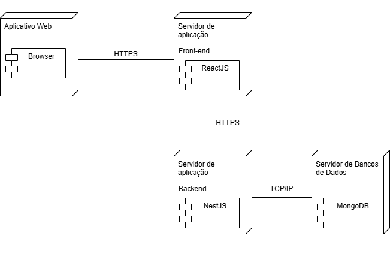

# 2.1.1 Diagrama de Implantação

## Diagrama de Implantação

### Objetivo

Esse documento tem como objetivo principal apresentar o diagrama de implantação no contexto do projeto. Ele visa ajudar no entendimento dos protocolos utilizados na migração de dados entre os diferentes processos do nosso sistema. Visa também ajudar na comunicação entre os membros do grupo e os stakeholders do projeto.

### Metodologia

A construção desse diagrama de implantação segue as diretrizes da UML (Unified Modeling Language), fornecendo tanto uma notação padronizada representando os componentes de software, quanto suas interações no ambiente de execução do software. No desenvolvimento do Diagrama de Implantação foi utilizado a ferramenta draw.io. Nesse diagrama, apontamos os principais elementos de infraestrutura que são necessários para o funcionamento do sistema da Pinacoteca Online: Servidor de Bancos de Dados, Servidor de aplicação, Servidor de aplicação e o Aplicativo Web.

O processo principal envolve fazer o mapeamento da distribuição do sistema estando em um ambiente de implantação típico, conectando os componente com as interações necessárias para a execução das funcionalidades, interações essas que são: o acesso ao front-end, a lógica de negócios no back-end e a persistência de dados no banco.

### Diagrama de Implantação

 <b>Figura 1:</b> Diagrama de Implantação

  

      
<b>Fonte:</b> <a href="https://github.com/renantfm4">Renan Araújo</a>, 2025

## Histórico de Versões

| Versão | Data       | Descrição             | Autor(es)       | Revisor(es)       |
| ------ | ---------- | --------------------- | --------------- | --------------- |
| 1.0    | 01/05/2025 | Adição da primeira versão do Diagrama | [Renan Araújo](https://github.com/renantfm4) | [Lucas Heler](https://github.com/Akaeboshi) |
| 1.1    | 05/05/2025 | Adição dos paragrafos de Objetivo e Metodologia | [Lucas Heler](https://github.com/Akaeboshi) | |