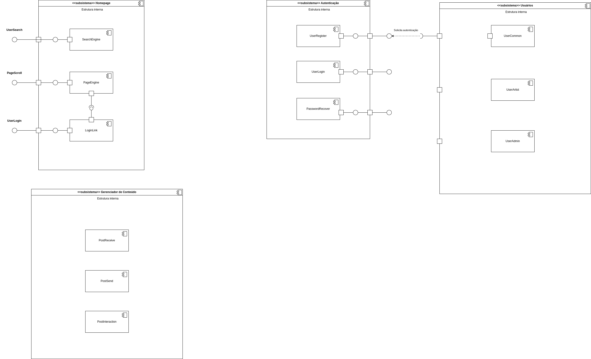

# 2.1.3 Módulo Notação UML – Diagrama de Componentes

## Introdução

## Metodologia

## Diagrama

## Conclusão

## Histórico de Versões

| Versão | Data       | Descrição                                                                          | Autor(es)                         | Revisor(es)       |
| ------ | ---------- | ---------------------------------------------------------------------------------- | --------------------------------- | ----------------- |
| 1.0    | 02/05/2025 | Criação do documento e versão inicial do diagrama com os subsistemas e componentes | Felipe de Sousa e Leandro Almeida | ### Preencher ### |
