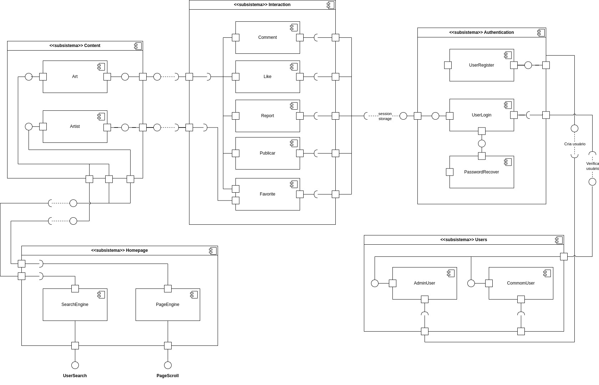

# 2.1.3 Módulo Notação UML – Diagrama de Componentes

## Introdução

## Metodologia

## Diagrama

Figura 1: Diagrama de Componentes.

Autores: Leandro Almeida, Felipe de Sousa e Marllon Fausto, 2025.

## Conclusão

## Gravação da Reunião

- [Vídeo 1: Gravação da reunião da realização do Diagrama de Componentes (parte 1).](https://drive.google.com/file/d/1nrjE8y-wmhvA9KtpHx0_d3rK6yz3P3x8/view?usp=sharing) 
  Participantes: Felipe de Sousa e Leandro Almeida
- [Vídeo 2: Gravação da reunião da realização do Diagrama de Componentes (parte 2).](https://drive.google.com/file/d/1GDof-AXUX33EcIujGPzXRo3-WjnhfFVU/view?usp=sharing) 
  Participantes: Leandro Almeida e Marllon Fausto

## Referências

## Histórico de Versões

| Versão | Data       | Descrição                                                                          | Autor(es)                         | Revisor(es)       |
| ------ | ---------- | ---------------------------------------------------------------------------------- | --------------------------------- | ----------------- |
| 1.0    | 02/05/2025 | Criação do documento e versão inicial do diagrama com os subsistemas e componentes | Felipe de Sousa e Leandro Almeida | ### Preencher ### |
| 1.1    | 03/05/2025 | Refatoração dos subsistemas e componentes; adição dos relacionamentos              | Leandro Almeida e Marllon Fausto  | Felipe de Sousa   |
| 1.2    | 03/05/2025 | Adição da gravação das reuniões                                                    | Leandro Almeida                   | Felipe de Sousa   |
