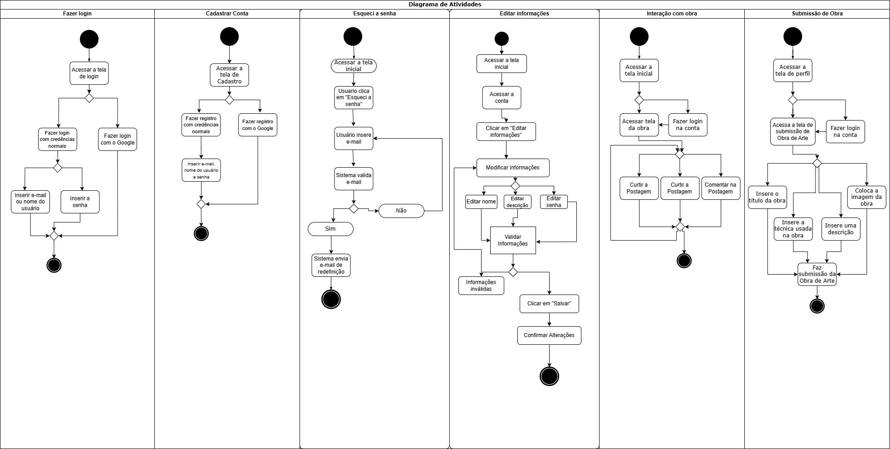

# 2.2.1. Diagrama de Atividades

## Introdução

O diagrama de atividades é um diagrama de comportamento da Linguagem de Modelagem Unificada (UML) que representa o fluxo dinâmico de processos ou atividades em um sistema. Ele é amplamente utilizado para modelar a lógica de algoritmos, processos de negócios, fluxos de trabalho ou casos de uso, promovendo uma comunicação clara entre equipes técnicas e não técnicas. Este documento oferece uma visão detalhada sobre o diagrama de atividades, incluindo seus componentes, notações, benefícios, limitações e um exemplo prático, além de boas práticas para sua criação e referências para aprofundamento.

O diagrama de atividades é especialmente útil para:
  - Visualizar a sequência de ações em um processo;
  - Identificar pontos de decisão e ramificações;
  - Modelar atividades paralelas ou concorrentes;
  - Documentar fluxos complexos para validação com partes interessadas.

## Metodologia

A criação de um diagrama de atividades segue um processo estruturado que envolve a identificação dos componentes do sistema e a definição do fluxo de atividades. Abaixo está a metodologia sugerida para desenvolver um diagrama de atividades:

1. **Identificação do Escopo**: Determine o processo ou caso de uso a ser modelado, como um fluxo de trabalho específico ou uma funcionalidade do sistema.
2. **Definição de Ações**: Liste as tarefas ou ações realizadas pelos usuários ou pelo software, representadas por retângulos de cantos arredondados.
3. **Mapeamento de Fluxos**: Estabeleça a sequência das ações utilizando setas (fluxos de controle) para indicar a ordem de execução.
4. **Inclusão de Decisões**: Identifique pontos de decisão (representados por losangos) onde o fluxo pode se ramificar com base em condições específicas.
5. **Adição de Nós Iniciais e Finais**: Marque o início (círculo preto) e o fim (círculo preto com borda) do processo.
6. **Incorporação de Sincronizações**: Utilize barras de sincronização para representar atividades paralelas ou convergência de fluxos.
7. **Validação**: Revise o diagrama com as partes interessadas para garantir que ele represente com precisão o processo.

## Componentes e Notações

Os diagramas de atividades utilizam uma notação padronizada pela UML. A tabela abaixo descreve os principais elementos:

| Elemento                   | Descrição                                                              | Notação                                                           |
| -------------------------- | ---------------------------------------------------------------------- | ----------------------------------------------------------------- |
| **Nó Inicial**             | Marca o início do fluxo de atividades.                                 | Círculo preto preenchido.                                         |
| **Nó Final**               | Indica o término do fluxo de atividades.                               | Círculo preto com borda dupla.                                    |
| **Ação**                   | Representa uma tarefa ou atividade executada.                          | Retângulo com cantos arredondados.                                |
| **Fluxo de Controle**      | Define a sequência entre ações ou outros elementos.                    | Seta direcionada.                                                 |
| **Nó de Decisão**          | Representa um ponto onde o fluxo se ramifica com base em uma condição. | Losango com múltiplas saídas.                                     |
| **Nó de Fusão**            | Une fluxos alternativos provenientes de um nó de decisão.              | Losango com múltiplas entradas e uma saída.                       |
| **Barra de Sincronização** | Indica o início (fork) ou fim (join) de atividades paralelas.          | Barra horizontal ou vertical grossa.                              |
| **Swimlanes**              | Separam responsabilidades por atores ou componentes do sistema.        | Linhas verticais ou horizontais que dividem o diagrama em faixas. |

## Diagrama de Atividades

<b>Figura 1:</b> Diagrama de Atividades

<b>Autores:</b> Renan Araújo, Lucas Heler e Mateus Cavalcante, 2025

## Referências

> Lucidchart. _O que é um diagrama de atividades UML?_. Disponível em: <https://www.lucidchart.com/pages/pt/o-que-e-diagrama-de-atividades-uml>. Acesso em: 08/05/2025.

> ServiceNow. "O que é um diagrama de atividades?". Disponível em: [https://www.servicenow.com/br/workflows/creator-workflows/what-is-activity-diagram.html](https://www.servicenow.com/br/workflows/creator-workflows/what-is-activity-diagram.html).

## Histórico de Versões

| Versão | Data       | Descrição                                             | Autor(es)                                                                                                                                       | Revisor(es)                                   |
| ------ | ---------- | ----------------------------------------------------- | ----------------------------------------------------------------------------------------------------------------------------------------------- | --------------------------------------------- |
| 1.0    | 08/05/2025 | Criação inicial do documento e diagrama de atividades | [Renan Araújo](https://github.com/renantfm4), [Lucas Heler](https://github.com/akaeboshi), [Mateus Cavalcante](https://github.com/mateuscavati) | [Leandro Almeida](https://github.com/LeanArs) |
| 1.1    | 08/05/2025 | Adicionando referências                               | [Renan Araújo](https://github.com/renantfm4)                                                                                                    | [Leandro Almeida](https://github.com/LeanArs) |
| 1.2    | 08/05/2025 | Fazendo ajustes no texto e colocando colaboradores    | [Renan Araújo](https://github.com/renantfm4)                                                                                                    | [Leandro Almeida](https://github.com/LeanArs) |
