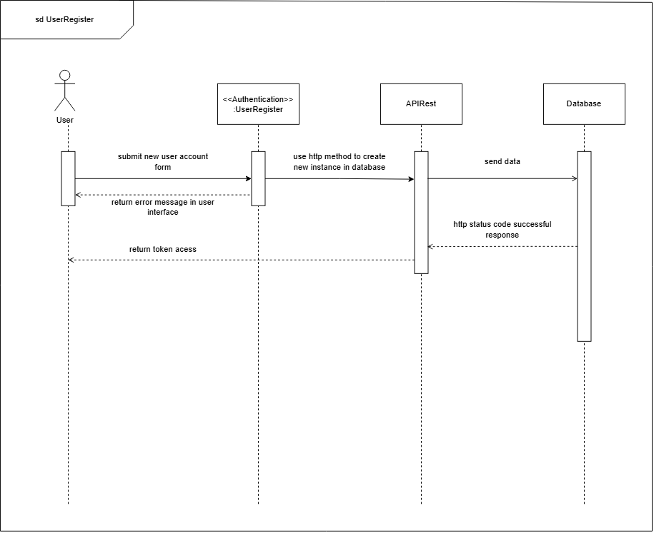
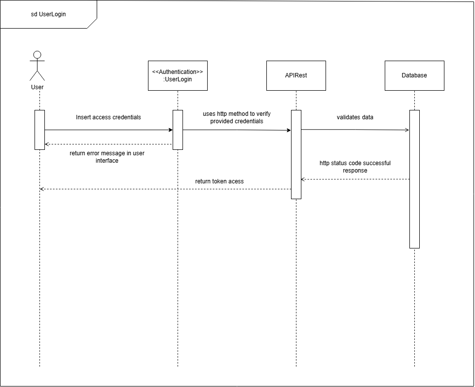
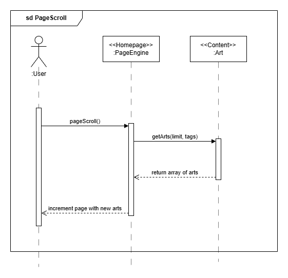
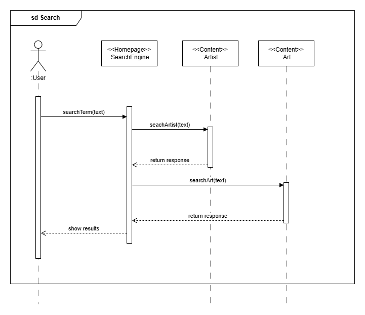
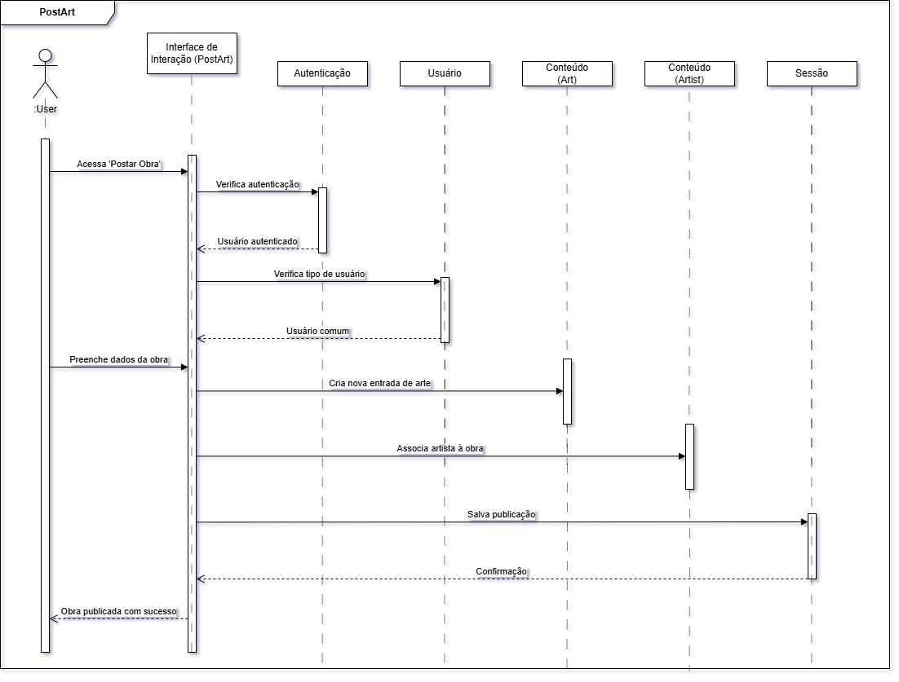
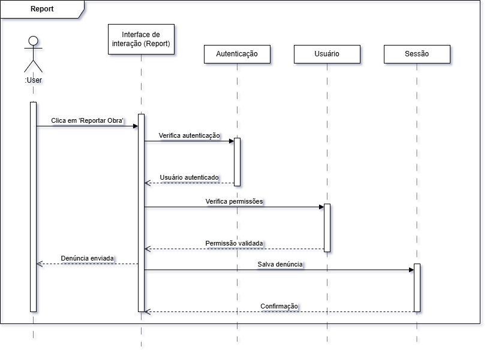

# 2.2.2. Diagrama de Sequência

## Introdução

O diagrama de sequência é um dos recursos mais utilizados na modelagem dinâmica da linguagem UML (Unified Modeling Language), sendo fundamental para representar visualmente a interação entre objetos em um sistema ao longo do tempo. Ele ilustra a troca de mensagens entre diferentes participantes, destacando a ordem em que essas interações ocorrem e evidenciando as estruturas de controle envolvidas. Cada objeto participante é representado por uma linha de vida, e as mensagens trocadas são dispostas em sequência vertical, permitindo a compreensão clara do fluxo de um processo.

## Metodologia

A elaboração dos diagramas de sequência foi realizada com base nos casos de uso definidos a partir do [protótipo](https://unbarqdsw2025-1-turma01.github.io/2025.1-T01-_G2_PinacotecaOnline_Entrega_01/#/Base/1.1.4.Prototype) desenvolvido na Entrega 1. Esses casos de uso foram distribuídos entre os integrantes da equipe — Jésus, Felipe, Leandro e Marllon — conforme suas respectivas responsabilidades no projeto.

Para identificar os objetos participantes de cada diagrama de sequência, utilizou-se como referência o [diagrama de componentes](/Modelagem/2.1.3.DiagramaComponentes), o qual oferece uma visão estrutural dos módulos e serviços envolvidos na aplicação. Com isso, foi possível mapear com precisão os elementos e interações presentes em cada fluxo funcional modelado.

## Diagramas de Sequência

  
<strong>Caso de uso: Cadastrar</strong>

  
<b>Figura 1:</b> Diagrama de Sequência - Cadastrar

  

  

  
<b>Autor:</b> Marllon Fausto, 2025.

  
<strong>Caso de uso: Login</strong>

  
<b>Figura 2:</b> Diagrama de Sequência - Login

  

  

  
<b>Autor:</b> Marllon Fausto, 2025.

  
<strong>Caso de uso: Scroll</strong>

  
<b>Figura 3:</b> Diagrama de Sequência - Scroll

  

  

  
<b>Autor:</b> Felipe de Sousa, 2025.

  
<strong>Caso de uso: Pesquisar</strong>

  
<b>Figura 4:</b> Diagrama de Sequência - Pesquisar

  

  

  
<b>Autor:</b> Felipe de Sousa, 2025.

  
<strong>Caso de uso: Postar</strong>

  
<b>Figura 5:</b> Diagrama de Sequência - Postar

  

  

  
<b>Autor:</b> Jésus Gabriel, 2025.

  
<strong>Caso de uso: Curtir</strong>

  
<b>Figura 6:</b> Diagrama de Sequência - Curtir

  

  

  
<b>Autor:</b> Leandro Almeida, 2025.

  
<strong>Caso de uso: Favoritar</strong>

  
<b>Figura 7:</b> Diagrama de Sequência - Favoritar

  

  

  
<b>Autor:</b> Leandro Almeida, 2025.

  
<strong>Caso de uso: Comentar</strong>

  
<b>Figura 8:</b> Diagrama de Sequência - Comentar

  

  

  
<b>Autor:</b> Leandro Almeida, 2025.

  
<strong>Caso de uso: Denunciar</strong>

  
<b>Figura 9:</b> Diagrama de Sequência - Denunciar

  

  

  
<b>Autor:</b> Jésus Gabriel, 2025.

## Conclusão

Os Diagramas de Sequência detalham o fluxo das principais funcionalidades do sistema, como login, cadastro, pesquisa, navegação e interações com conteúdos. Eles facilitam o entendimento do comportamento do sistema, apoiam a validação dos requisitos e contribuem para uma comunicação clara entre os membros da equipe por meio da padronização UML.

## Referências

> UML Diagrams. UML sequence diagrams overview. Disponível em: https://www.uml-diagrams.org/sequence-diagrams.html. Acesso em: 03 maio 2025.

> BOSON Treinamentos. Curso de UML - O que é um Diagrama de Sequência. Disponível em: https://www.youtube.com/watch?v=UVkj3ed0ZuM&. Acesso em: 03 maio 2025.

> BOSON Treinamentos. Curso de UML - Diagrama de Sequência UML - Exemplo Básico. Disponível em: https://www.youtube.com/watch?v=LeV6RO-6Tn4. Acesso em: 03 maio 2025.

## Histórico de Versões

| Versão | Data       | Descrição                                                                                                                           | Autor(es)                                      | Revisor(es)       |
| ------ | ---------- | ----------------------------------------------------------------------------------------------------------------------------------- | ---------------------------------------------- | ----------------- |
| 1.0    | 04/05/2025 | Criação do documento e versão inicial do diagrama com os fluxos de scroll e pesquisa                                                | [Felipe de Sousa](https://github.com/fsousac)  | [Renan Araújo](https://github.com/renantfm4) |
| 1.1    | 08/05/2025 | Criação e adição dos diagramas de sequência PostArt e Report, além da elaboração da conclusão referente aos diagramas de sequência. | [Jésus Gabriel](https://github.com/xGabrielCv) | [Renan Araújo](https://github.com/renantfm4)  |
| 1.2    | 08/05/2025 | Formatação da seção de diagrama de sequência.                                                                                       | [Leandro Almeida](https://github.com/LeanArs)  | [Renan Araújo](https://github.com/renantfm4) |
| 1.3    | 08/05/2025 | Inserção dos diagramas de sequência dos casos de uso de curtir, favoritar e comentar                                                | [Leandro Almeida](https://github.com/LeanArs)  | [Renan Araújo](https://github.com/renantfm4)  |
| 1.4    | 08/05/2025 | Ajuste na estrutura dos diagramas PostArt e Report                                                                                  | [Jésus Gabriel](https://github.com/xGabrielCv) | [Renan Araújo](https://github.com/renantfm4)  |
| 1.5    | 08/05/2025 | Inserção dos diagramas de sequência dos casos de uso de cadastro e login.                                                           | [Marllon](https://github.com/m4rllon)          | [Renan Araújo](https://github.com/renantfm4) |
| 1.6    | 08/05/2025 | Adição de texto introdutório sobre o Diagrama de Sequência.                                                                         | [Marllon](https://github.com/m4rllon)          | [Renan Araújo](https://github.com/renantfm4)  |
| 1.7    | 08/05/2025 | Adição da imagens dos Diagramas de Sequência de PageScroll e Pequisar. Inserção das Referências                                     | [Felipe de Sousa](https://github.com/fsousac)  | [Renan Araújo](https://github.com/renantfm4)  |
| 1.8    | 09/05/2025 | Padronizando documento e adicionando metodologia                                                                                    | [Leandro Almeida](https://github.com/LeanArs)  | [Renan Araújo](https://github.com/renantfm4)  |
| 1.9   | 09/05/2025 | Corrigindo a enumeração das figuras e revisando documento                                                                           | [Renan Araújo](https://github.com/renantfm4)   | [Leandro Almeida](https://github.com/LeanArs) |
