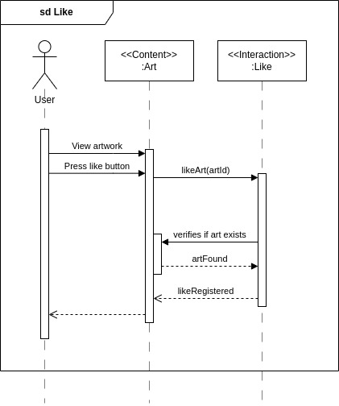
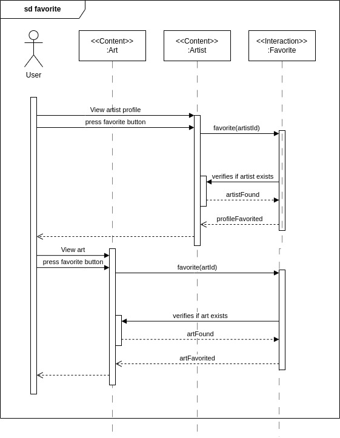
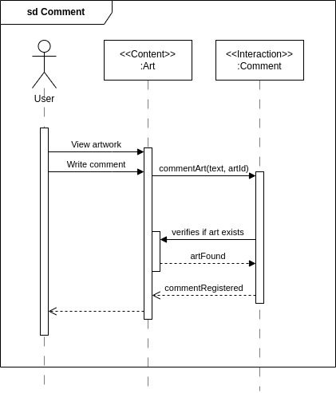

# 2.2.2 Módulo Notação UML – Diagrama de Sequência

## Introdução

## Metodologia

## Diagramas de Sequência

  
<strong>Caso de uso: Cadastrar</strong>

  
Figura 1: Diagrama de Sequência - Cadastrar

  

  

  
Autores: Marllon Fausto, 2025.

  
<strong>Caso de uso: Login</strong>

  
Figura 1: Diagrama de Sequência - Login

  

  

  
Autores: Marllon Fausto, 2025.

  
<strong>Caso de uso: Scroll</strong>

  
Figura 2: Diagrama de Sequência - Scroll

  

  

  
Autores: Marllon Fausto, 2025.

  
<strong>Caso de uso: Pesquisar</strong>

  
Figura 3: Diagrama de Sequência - Pesquisar

  

  

  
Autores: Marllon Fausto, 2025.

  
<strong>Caso de uso: Postar</strong>

  
Figura 4: Diagrama de Sequência - Postar

  

  

  
Autores: Marllon Fausto, 2025.

  
<strong>Caso de uso: Curtir</strong>

  
Figura 5: Diagrama de Sequência - Curtir

  

  

  
Autores: Leandro Almeida, 2025.

  
<strong>Caso de uso: Favoritar</strong>

  
Figura 6: Diagrama de Sequência - Favoritar

  

  

  
Autores: Leandro Almeida, 2025.

  
<strong>Caso de uso: Comentar</strong>

  
Figura 7: Diagrama de Sequência - Comentar

  

  

  
Autores: Leandro Almeida, 2025.

  
<strong>Caso de uso: Denunciar</strong>

  
Figura 8: Diagrama de Sequência - Denunciar

  

  

  
Autores: Marllon Fausto, 2025.

## Conclusão

Os Diagramas de Sequência detalham o fluxo das principais funcionalidades do sistema, como login, cadastro, pesquisa, navegação e interações com conteúdos. Eles facilitam o entendimento do comportamento do sistema, apoiam a validação dos requisitos e contribuem para uma comunicação clara entre os membros da equipe por meio da padronização UML.

## Referências

## Histórico de Versões

| Versão | Data       | Descrição                                                                                                                           | Autor(es)                                     | Revisor(es)       |
| ------ | ---------- | ----------------------------------------------------------------------------------------------------------------------------------- | --------------------------------------------- | ----------------- |
| 1.0    | 04/05/2025 | Criação do documento e versão inicial do diagrama com os fluxos de scroll e pesquisa                                                | Felipe de Sousa                               | ### Preencher ### |
| 1.1    | 08/05/2025 | Criação e adição dos diagramas de sequência PostArt e Report, além da elaboração da conclusão referente aos diagramas de sequência. | Jésus Gabriel                                 | ### Preencher ### |
| 1.2    | 08/05/2025 | Formatação da seção de diagrama de sequência.                                                                                       | [Leandro Almeida](https://github.com/LeanArs) | ### Preencher ### |
| 1.3    | 08/05/2025 | Inserção dos diagramas de sequência dos casos de uso de curtir, favoritar e comentar                                                | [Leandro Almeida](https://github.com/LeanArs) | ### Preencher ### |
