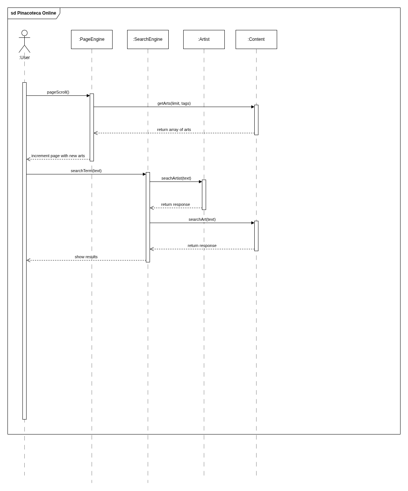

# 2.2.2 Módulo Notação UML – Diagrama de Sequência

## Introdução

## Metodologia

## Diagrama

Figura 1: Diagrama de Sequencia.

Autores: Felipe de Sousa 2025.

## Conclusão

## Gravação da Reunião

## Referências

## Histórico de Versões

| Versão | Data       | Descrição                                                                            | Autor(es)       | Revisor(es)       |
| ------ | ---------- | ------------------------------------------------------------------------------------ | --------------- | ----------------- |
| 1.0    | 04/05/2025 | Criação do documento e versão inicial do diagrama com os fluxos de scroll e pesquisa | Felipe de Sousa | ### Preencher ### |
