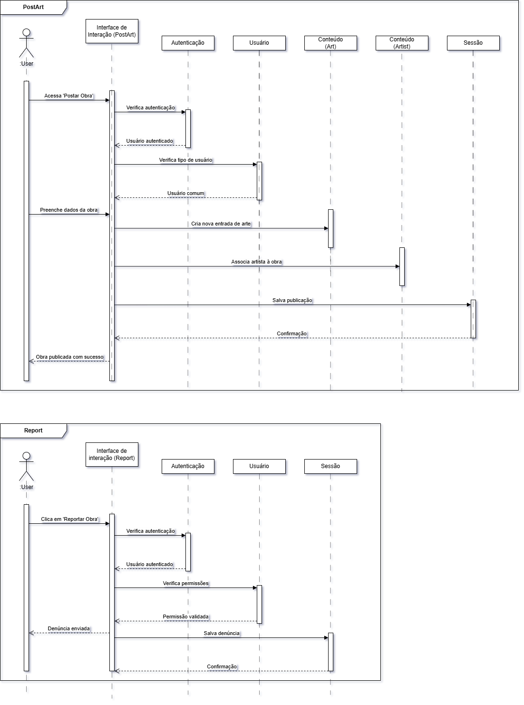

# 2.2.2 Módulo Notação UML – Diagrama de Sequência

## Introdução

## Metodologia

## Diagrama

Figura 1: Diagrama de Sequencia.

Autores: Felipe de Sousa, Leandro Almeida 2025.

Figura 2: Diagrama de Sequencia (PostArt e Report)

Autor: Jésus Gabriel Carvalho Ventura 2025.

## Conclusão
Os Diagramas de Sequência detalham o fluxo das principais funcionalidades do sistema, como login, cadastro, pesquisa, navegação e interações com conteúdos. Eles facilitam o entendimento do comportamento do sistema, apoiam a validação dos requisitos e contribuem para uma comunicação clara entre os membros da equipe por meio da padronização UML.
## Gravação da Reunião

## Referências

## Histórico de Versões

| Versão | Data       | Descrição                                                                            | Autor(es)       | Revisor(es)       |
| ------ | ---------- | ------------------------------------------------------------------------------------ | --------------- | ----------------- |
| 1.0    | 04/05/2025 | Criação do documento e versão inicial do diagrama com os fluxos de scroll e pesquisa | Felipe de Sousa | ### Preencher ### |
| 1.1    | 08/05/2025 | Criação e adição dos diagramas de sequência PostArt e Report, além da elaboração da conclusão referente aos diagramas de sequência.| Jésus Gabriel | ### Preencher ### |
