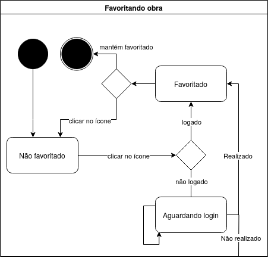
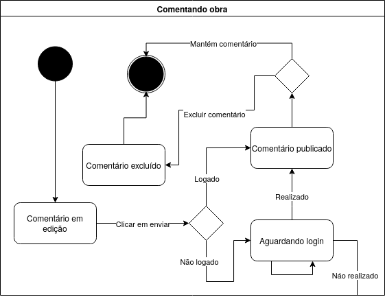
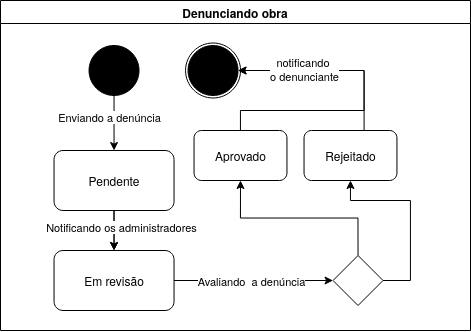
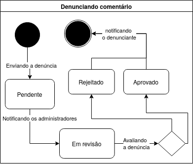

# 2.2.4 Módulo Notação UML – Diagrama de Estados

## Introdução

O diagrama de estados é um tipo de diagrama comportamental da UML utilizado para modelar o ciclo de vida de um objeto dentro do sistema. Ele descreve os diferentes estados que um objeto pode assumir, bem como os eventos que provocam a transição entre esses estados. Essa representação é especialmente útil para visualizar comportamentos reativos e garantir a consistência nas interações com os elementos da aplicação.

Esse tipo de modelagem auxilia na definição das regras de negócio, na antecipação de possíveis exceções de uso e no controle de transições críticas, como login, submissões e moderação de conteúdo. Além disso, torna explícito o comportamento esperado de componentes interativos, contribuindo para um design mais robusto e previsível.

## Metodologia

A construção do diagrama de estados foi baseada nos fluxos identificados durante o Design Sprint e nos requisitos funcionais extraídos do protótipo de alta fidelidade. Foram mapeados os ciclos de interação do usuário com as funcionalidades de favoritar, comentar, denunciar comentário e denunciar obra. O diagrama foi elaborado com a ferramenta Draw.io, utilizando os símbolos padrão da UML.

## Diagrama

O diagrama de estados contempla os seguintes fluxos principais de interação na plataforma da Pinacoteca Online:

  
<strong>Diagrama de Estado: Favoritando Obra</strong>

  
Figura 1: Diagrama de Estado - Favoritando Obra

  

  

  
Autor: Danielle Rodrigues, 2025.

• **Favoritando obra**: Esse fluxo descreve o comportamento do sistema quando um usuário interage com o botão de favoritar uma obra. Inicialmente, a obra está no estado "Não favoritado". Ao clicar no ícone de favorito, o sistema verifica se o usuário está autenticado. Se estiver logado, a ação é realizada e o estado muda para "Favoritado". Se o usuário não estiver logado, o sistema o redireciona para o estado "Aguardando login", impedindo a ação até que o login seja efetuado ou ação seja encerrada. Uma vez logado, o usuário pode manter o estado de favorito ou desfazê-lo clicando novamente no ícone. Se a ação for encerrada o usuário irá sair da autenticação.

  
<strong>Diagrama de Estado: Comentando obra</strong>

  
Figura 2: Diagrama de Estado - Comentando obra

  

  

  
Autor: Davi Rodrigues, 2025.

• **Comentando obra**: Esse fluxo representa o ciclo completo da publicação de um comentário na plataforma. O processo se inicia no estado "Comentário em edição", momento em que o usuário insere o conteúdo desejado. Ao clicar em "Enviar", o sistema realiza uma verificação de autenticação. Se o usuário estiver logado, o comentário é publicado com sucesso, e o estado transita para "Comentário publicado". Caso o usuário não esteja autenticado, a aplicação redireciona para o estado "Aguardando login", interrompendo temporariamente a ação até que o login seja realizado. Se o login não for concluído ou a ação for cancelada, o fluxo é encerrado sem publicação. Além disso, caso o comentário tenha sido publicado, há a opção de exclusão, o que leva o objeto ao estado "Comentário excluído".

  
<strong>Diagrama de Estado: Denunciando obra</strong>

  
Figura 3: Diagrama de Estado - Denunciando obra

  

  

  
Autor: Alana Gabriele, 2025.

• **Denunciando obra**: Esse fluxo modela o processo de denúncia de uma obra por parte de um usuário. O estado inicial é "Pendente", logo após o envio da denúncia. A denúncia é então encaminhada aos administradores e passa para o estado "Em revisão". Após a avaliação, ela pode ser classificada como "Aprovada" ou "Rejeitada", e o denunciante é notificado da decisão.

  
<strong>Diagrama de Estado: Denunciando Comentário</strong>

  
Figura 4: Diagrama de Estado - Denunciando comentário

  

  

  
Autor: Alana Gabriele, 2025.

• **Denunciando comentário**: Esse fluxo segue a mesma lógica do anterior, porém é aplicado especificamente aos comentários. A denúncia começa no estado "Pendente", passa para "Em revisão" quando os administradores são notificados e, após análise, transita para "Aprovado" ou "Rejeitado".

## Conclusão

O diagrama de estados permite representar de forma precisa os ciclos de vida dos objetos envolvidos nas principais interações do sistema, garantindo clareza sobre os comportamentos esperados em cada situação. A padronização por meio da notação UML facilita a comunicação entre os membros da equipe e contribui para a definição de fluxos mais confiáveis e coesos.

Ao mapear explicitamente os eventos que provocam transições e os estados intermediários de cada funcionalidade, esse tipo de modelagem fortalece a robustez do sistema, antecipando exceções e assegurando uma experiência mais estável para os usuários.

## Gravação da Reunião

- [Vídeo 1: Gravação da reunião da realização do Diagrama de Estados.](https://drive.google.com/file/d/179eTha9lBJC3YQ-kma0HoA75WbZ05pKg/view?usp=drive_link) 
  Participantes: Danielle Rodrigues, Davi Rodrigues e Alana Gabriele

## Referências

> SERRANO, Milene. Arquitetura e desenho de software: aula – modelagem UML dinâmica. [S.l.]: Universidade de Brasília. Acesso em: 4 maio 2025.

> ABDALA, Cláudio. Diagrama de estados. [S.l.]: Universidade Federal de Uberlândia. Disponível em: https://www.facom.ufu.br/~abdala/DAS5312/Diagrama%20de%20Estados.pdf. Acesso em: 4 maio 2025

## Histórico de Versões

| Versão | Data       | Descrição                                                  | Autor(es)                                                                                                                                              | Revisor(es) |
| ------ | ---------- | ---------------------------------------------------------- | ------------------------------------------------------------------------------------------------------------------------------------------------------ | ----------- |
| 1.0    | 08/05/2025 | Criação do documento e versão final do diagrama de estados | [Danielle Rodrigues](https://github.com/Danizelle), [Davi Rodrigues](https://github.com/DaviRogs) e [Alana Gabriele](https://github.com/Alanagabriele) |             |
| 1.1    | 08/05/2025 | Adição da introdução, metodologia, diagrama e conclusão.   | [Danielle Rodrigues](https://github.com/Danizelle)                                                                                                     |
| 1.2    | 08/05/2025 | Adição da referência                                       | [Alana Gabriele](https://github.com/Alanagabriele)                                                                                                     |             |
| 1.3    | 08/05/2025 | Adição dos diagramas de estado separadamete                                       | [Davi Rodrigues](https://github.com/DaviRogs)                                                                                                     |             |
