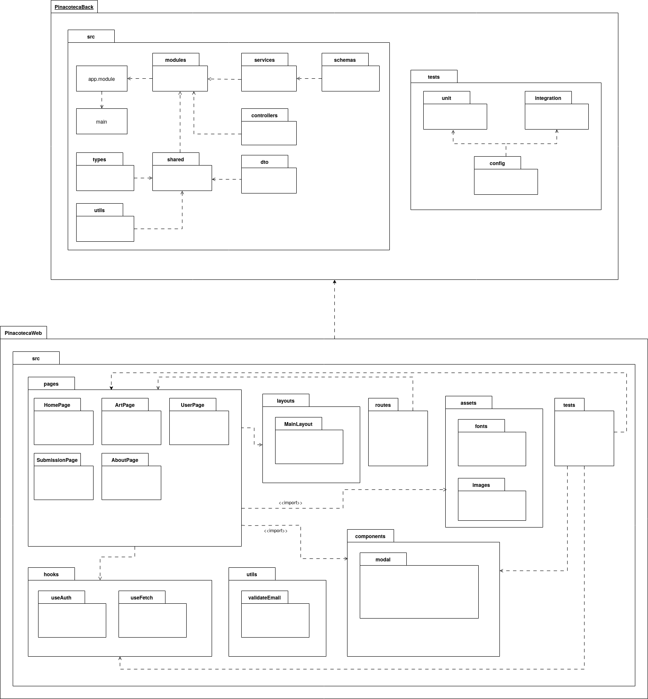
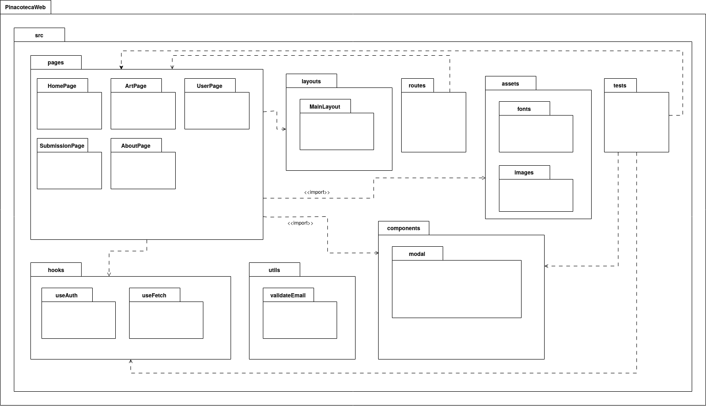
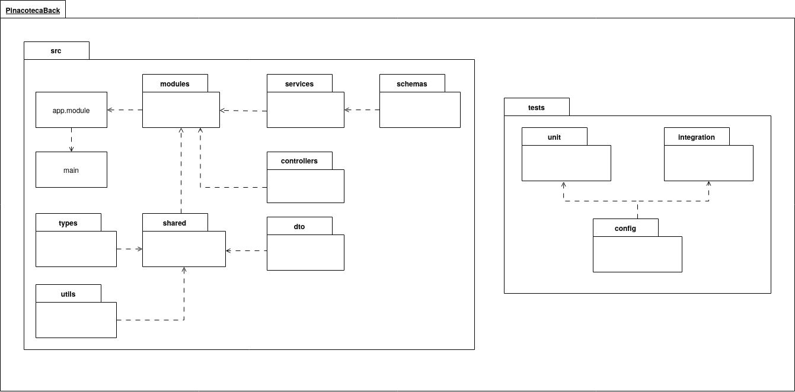

# 2.3.1. Diagrama de Pacotes

## Introdução

Esta seção tem como objetivo apresentar o Diagrama de Pacotes. O diagrama visual ilustrar a organização modular do sistema, evidenciando a estrutura e as dependências entre os pacotes que agrupam os elementos relacionados, como classes e interfaces, facilitando a compreensão da arquitetura geral da aplicação.

## Metodologia

Em uma discussão interna no grupo, decidimos montar para o foco 3 dois diagramas: um Diagrama de Pacotes e um Diagrama de Casos de Uso. Para isso dividimos o grupo em dois subgrupos para desenvolver os diagramas. Para realizar o diagrama de pacotes a equipe se reuniu utilizando a ferramenta Microsoft Teams e realizou o diagrama por meio da ferramenta Draw.io junto ao Google Drive para trabalharmos em conjunto. Durante a gravação da reunião montamos a diagrama e discutimos sobre como seria organizado o software, e assim trabalhamos no Draw.io em conjunto para otimizar o tempo. Durante a reunião os membros discutiam a organização dos sistemas Backend (PinacotecaBack) e Frontend (PinacotecaWeb) e iam completando o diagrama como mostrado a seguir.

## Diagrama de Pacotes

Inicialmente, discutimos sobre como seria a estrutura do projeto e decidimos fazer a modelagem seguindo a estrutura base dos projetos das tecnologias que serão utilizadas no desenvolvimento. Decidimos, portanto, com a arquitetura MVC no BackEnd com [Nestjs](https://docs.nestjs.com/) e no FrontEnd com [React.js](https://react.dev/). Assim, desenvolveu-se o diagrama da figura 1.

<b>Figura 1:</b> Diagrama de Pacotes.

<b>Autores:</b> Alana Gabriele, Lucas Heler, Felipe de Sousa, Davi Rodrigues e Leandro Almeida, 2025.

#### Frontend

O diagrama de pacotes abaixo representa a estrutura modular do frontend da aplicação, construída com React. A organização separa claramente responsabilidades entre pacotes como pages, que agrupa as telas principais, components, com elementos reutilizáveis da interface, e layouts, que define a estrutura visual comum.

A navegação é gerenciada pelo pacote routes, enquanto lógica reutilizável fica concentrada em hooks, e funções auxiliares puras em utils. Recursos visuais como imagens e fontes estão em assets, e os testes são mantidos no diretório tests, reforçando a preocupação com a qualidade do sistema. Essa estrutura favorece a escalabilidade e a manutenção do projeto.

<b>Figura 2:</b> Diagrama de Pacotes - Frontend.

<b>Autores:</b> Alana Gabriele, Lucas Heler, Felipe de Sousa, Davi Rodrigues e Leandro Almeida, 2025.

#### Backend

O diagrama de pacotes abaixo representa a estrutura organizacional do backend baseado no framework NestJS, destacando a separação entre responsabilidades como módulos, serviços, controladores, DTOs e schemas.

A arquitetura adota uma abordagem modular, favorecendo a reutilização de código por meio de pastas compartilhadas, como shared, além de isolar os testes em unit e integration, com suas configurações específicas. Essa estrutura visa garantir a escalabilidade, legibilidade e manutenibilidade do sistema à medida que ele evolui.

<b>Figura 3:</b> Diagrama de Pacotes - Backend.

<b>Autores:</b> Alana Gabriele, Lucas Heler, Felipe de Sousa, Davi Rodrigues e Leandro Almeida, 2025.

## Conclusão

O Diagrama de Pacotes mostra como o sistema foi dividido em partes no frontend e no backend, seguindo a forma como React e NestJS normalmente são organizados. No frontend, usamos pastas como pages, components e routes para separar as telas, os componentes e a navegação. No backend, usamos modules, services e controllers para organizar a lógica do sistema. Tudo foi decidido em grupo durante a reunião e feito de forma colaborativa no Draw.io, para refletir como o projeto será realmente desenvolvido.

## Gravação da Reunião

- [Vídeo 1: Gravação da reunião da realização do Diagrama de Componentes](https://drive.google.com/file/d/1pGvYpVa-MEvHDezNnZBZh8xoB0BTdIn_/view?usp=drive_link) 
  Participantes: Alana Gabriele, Davi Rodrigues, Felipe de Sousa, Leandro Almeida, e Lucas Heler

## Referências

> SERRANO, Milene. 05g - VideoAula - DSW-Modelagem - Pacotes. 2020. Vídeo (Aula de Arquitetura e Desenho de Software). Disponível em: https://unbbr-my.sharepoint.com/:v:/g/personal/mileneserrano_unb_br/ET671ARgXk9IqVY576GYDv8BV1oQeFKBdIYnUbbxl3gAwA?e=lq7Vfw. Acesso em: 8 maio 2025

> IBM. Packages diagrams. Disponível em: https://www.ibm.com/docs/en/dma?topic=diagrams-packages. Acesso em: 8 maio 2025.

## Histórico de Versões

| Versão | Data       | Descrição                                       | Autor(es)                                                                                                                                                                                                                                    | Revisor(es)     |
| ------ | ---------- | ----------------------------------------------- | -------------------------------------------------------------------------------------------------------------------------------------------------------------------------------------------------------------------------------------------- | --------------- |
| 1.0    | 08/05/2025 | Criação do documento                            | [Leandro Almeida](https://github.com/LeanArs)                                                                                                                                                                                                |[Danielle Rodrigues](https://github.com/Danizelle) |
| 1.1    | 08/05/2025 | Adição introdução                               | [Leandro Almeida](https://github.com/LeanArs)                                                                                                                                                                                                |[Danielle Rodrigues](https://github.com/Danizelle)|
| 1.2    | 08/05/2025 | Adição referências                              | [Leandro Almeida](https://github.com/LeanArs)                                                                                                                                                                                                | [Danielle Rodrigues](https://github.com/Danizelle) |
| 1.3    | 08/05/2025 | Adição da metodologia                           | [Felipe de Sousa](https://github.com/fsousac)                                                                                                                                                                                                | [Danielle Rodrigues](https://github.com/Danizelle) |
| 1.4    | 08/05/2025 | Explicação do diagrama backend                  | [Alana Gabriele](https://github.com/alanagabriele)                                                                                                                                                                                           |[Danielle Rodrigues](https://github.com/Danizelle)|
| 1.5    | 08/05/2025 | Explicação do diagrama frontend                 | [Lucas Heler](https://github.com/akaeboshi)                                                                                                                                                                                                  |[Danielle Rodrigues](https://github.com/Danizelle) |
| 1.6    | 08/05/2025 | Modelagem de uma versão consolidada do diagrama | [Alana Gabriele](https://github.com/alanagabriele), [Davi Rodrigues](https://github.com/DaviRogs), [Felipe de Sousa](https://github.com/fsousac), [Leandro Almeida](https://github.com/LeanArs), [Lucas Heler](https://github.com/akaeboshi) |[Danielle Rodrigues](https://github.com/Danizelle) |
| 1.7    | 08/05/2025 | Adição do diagrama ao documento                 | [Davi Rodrigues](https://github.com/DaviRogs)                                                                                                                                                                                                |[Danielle Rodrigues](https://github.com/Danizelle) |
| 1.8    | 08/05/2025 | Adição link da gravação                         | [Leandro Almeida](https://github.com/LeanArs)                                                                                                                                                                                                |[Danielle Rodrigues](https://github.com/Danizelle) |
| 1.9    | 08/05/2025 | Adição da conclusão                             | [Lucas Heler](https://github.com/akaeboshi)                                                                                                                                                                                                  | [Danielle Rodrigues](https://github.com/Danizelle) |
| 2.0    | 09/05/2025 | Correção de ortografia                          | [Leandro Almeida](https://github.com/LeanArs)                                                                                                                                                                                                | [Danielle Rodrigues](https://github.com/Danizelle) |
