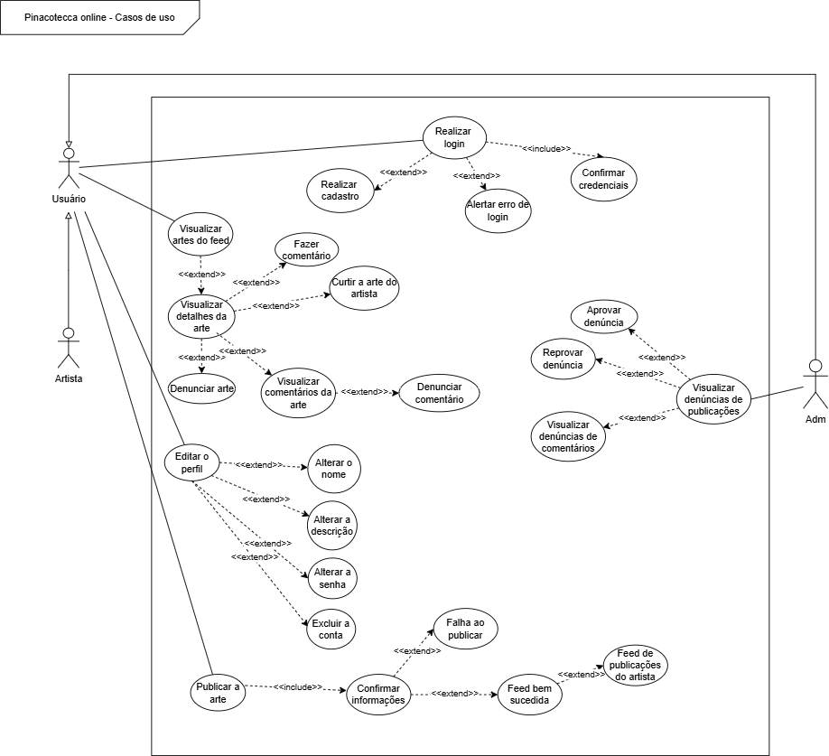

# 2.3.1 Diagrama de Casos de Uso

# Introdução
O diagrama de casos de uso representa, de forma simplificada, as interações entre os usuários da plataforma e as funcionalidades disponíveis no sistema. Ele ajuda a entender quem pode fazer o quê dentro da aplicação, servindo como um guia funcional para o desenvolvimento e validação dos requisitos.

Na Pinacoteca Online, o diagrama contempla ações como visualizar e publicar artes, comentar, denunciar, curtir conteúdos e moderar interações, envolvendo os perfis de usuário comum, artista e administrador.

# Metodologia

O diagrama foi elaborado com base nos requisitos identificados durante o Design Sprint e na estrutura funcional do protótipo de alta fidelidade. As ações foram organizadas conforme o tipo de usuário, e as relações <<include>> e <<extend>> foram utilizadas para indicar dependências obrigatórias e comportamentos condicionais. A modelagem foi feita na ferramenta Draw.io, seguindo os padrões da UML.

# Diagrama de Casos de Uso

Figura 1: Diagrama de Casos de Uso.

Autores: Danielle Rodrigues, Renan Araújo e Marllon Fausto, 2025.

# Especificações de Caso de Uso

# UC1 - Realizar Cadastro
| Campo                 | Descrição                                                                                                                                                                                                                                                                                                         |
| --------------------- | ----------------------------------------------------------------------------------------------------------------------------------------------------------------------------------------------------------------------------------------------------------------------------------------------------------------- |
| **Descrição**         | Permite que um novo usuário se cadastre no sistema da Pinacoteca Online, fornecendo seus dados pessoais.                                                                                                                                                                                                          |
| **Atores**            | Usuário                                                                                                                                                                                                                                                                                                           |
| **Pré-condição**      | O usuário ainda não possui uma conta registrada no sistema.                                                                                                                                                                                                                                                       |
| **Pós-condição**      | A conta do usuário é criada e ele pode realizar login no sistema.                                                                                                                                                                                                                                                 |
| **Fluxo Principal**   | 1. O usuário acessa a tela de cadastro.   2. O sistema exibe o formulário de cadastro.   3. O usuário preenche os campos obrigatórios (nome, e-mail, senha).   4. O sistema valida os dados inseridos.   5. O sistema salva os dados e cria a conta.   6. O sistema exibe uma mensagem de sucesso. |
| **Fluxo Alternativo** | 3a. O usuário preenche dados opcionais (descrição do perfil).   4a. O sistema aceita os dados extras se válidos.                                                                                                                                                                                               |
| **Fluxo de Exceções** | 4b. Se os dados forem inválidos (e.g., e-mail já em uso, senha fraca), o sistema exibe uma mensagem de erro e solicita correção.   5b. Se houver falha no servidor, o sistema informa erro e orienta o usuário a tentar mais tarde.                                                                            |

# UC2 - Publicar Arte
| Campo                 | Descrição                                                                                                                                                                                                                                                                                                  |
| --------------------- | ---------------------------------------------------------------------------------------------------------------------------------------------------------------------------------------------------------------------------------------------------------------------------------------------------------- |
| **Descrição**         | Permite que artistas publiquem obras de arte no sistema, tornando-as visíveis no feed.                                                                                                                                                                                                                     |
| **Atores**            | Artista                                                                                                                                                                                                                                                                                                    |
| **Pré-condição**      | O artista deve estar autenticado e possuir conta válida.                                                                                                                                                                                                                                                   |
| **Pós-condição**      | A arte é exibida no feed e associada ao perfil do artista.                                                                                                                                                                                                                                                 |
| **Fluxo Principal**   | 1. O artista acessa a opção “Publicar Arte”.   2. O sistema exibe o formulário de envio.   3. O artista insere as informações (imagem, título, técnica, descrição).   4. O sistema valida os dados.   5. A publicação é realizada com sucesso.   6. O sistema exibe confirmação de sucesso. |
| **Fluxo Alternativo** | 3a. O artista preenche apenas os campos obrigatórios.                                                                                                                                                                                                                                                      |
| **Fluxo de Exceções** | 4b. Se dados forem inválidos ou incompletos, o sistema notifica o erro.   5b. Se houver falha no envio da imagem, o sistema exibe erro e não finaliza a publicação.                                                                                                                                     |

#  UC3 - Visualizar Feed

| Campo                 | Descrição                                                                                                                                                                                  |
| --------------------- | ------------------------------------------------------------------------------------------------------------------------------------------------------------------------------------------ |
| **Descrição**         | Permite que o usuário visualize as publicações de arte no feed principal da plataforma.                                                                                                    |
| **Atores**            | Usuário                                                                                                                                                                                    |
| **Pré-condição**      | O usuário deve estar autenticado.                                                                                                                                                          |
| **Pós-condição**      | O sistema exibe uma lista de obras de arte publicadas.                                                                                                                                     |
| **Fluxo Principal**   | 1. O usuário acessa a página inicial (feed).   2. O sistema carrega as publicações disponíveis.   3. As artes são exibidas com suas respectivas informações (autor, título, imagem). |
| **Fluxo Alternativo** | 2a. O sistema ordena as artes por data de publicação ou relevância.                                                                                                                        |
| **Fluxo de Exceções** | 2b. Se não houver obras publicadas, o sistema informa que não há conteúdos disponíveis.   3b. Se houver falha na conexão com o servidor, uma mensagem de erro é exibida.                |

#  UC4 - Denunciar Comentário

| Campo                 | Descrição                                                                                                                                                                                                                                              |
| --------------------- | ------------------------------------------------------------------------------------------------------------------------------------------------------------------------------------------------------------------------------------------------------ |
| **Descrição**         | Permite que um usuário denuncie um comentário considerado inadequado ou ofensivo.                                                                                                                                                                      |
| **Atores**            | Usuário                                                                                                                                                                                                                                                |
| **Pré-condição**      | O usuário deve estar autenticado e visualizar um comentário existente.                                                                                                                                                                                 |
| **Pós-condição**      | A denúncia é registrada e enviada para análise do administrador.                                                                                                                                                                                       |
| **Fluxo Principal**   | 1. O usuário localiza um comentário ofensivo.   2. Clica na opção "Denunciar".   3. O sistema solicita o motivo da denúncia.   4. O usuário insere o motivo e confirma.   5. O sistema registra a denúncia e notifica que ela foi enviada. |
| **Fluxo Alternativo** | 3a. O usuário pode escolher entre motivos predefinidos ou escrever um motivo personalizado.                                                                                                                                                            |
| **Fluxo de Exceções** | 4b. Se o motivo estiver em branco, o sistema impede o envio e exibe uma mensagem de erro.   5b. Se houver erro de conexão, a denúncia não é registrada e o usuário é notificado.                                                                    |

#  UC5 - Aprovar Denúncia

| Campo                 | Descrição                                                                                                                                                                                                                                                                   |
| --------------------- | --------------------------------------------------------------------------------------------------------------------------------------------------------------------------------------------------------------------------------------------------------------------------- |
| **Descrição**         | Permite que o administrador revise e aprove uma denúncia feita contra uma arte ou comentário.                                                                                                                                                                               |
| **Atores**            | Administrador                                                                                                                                                                                                                                                               |
| **Pré-condição**      | O administrador deve estar autenticado e existirem denúncias pendentes.                                                                                                                                                                                                     |
| **Pós-condição**      | O conteúdo denunciado é removido ou ocultado conforme regras da plataforma.                                                                                                                                                                                                 |
| **Fluxo Principal**   | 1. O administrador acessa a área de denúncias.   2. O sistema exibe a lista de denúncias pendentes.   3. O administrador seleciona uma denúncia.   4. Analisa o conteúdo e decide pela aprovação.   5. O sistema remove/oculta o conteúdo e registra a decisão. |
| **Fluxo Alternativo** | 4a. O administrador decide não aprovar e arquiva a denúncia.                                                                                                                                                                                                                |
| **Fluxo de Exceções** | 2b. Se não houver denúncias pendentes, o sistema informa que não há nada para revisar.   5b. Se ocorrer erro ao aplicar a penalidade, o sistema exibe mensagem e solicita nova tentativa.                                                                                |

#  UC6 - Curtir Obra

| Campo                 | Descrição                                                                                                                                                         |
| --------------------- | ----------------------------------------------------------------------------------------------------------------------------------------------------------------- |
| **Descrição**         | Permite que um usuário registre uma curtida em uma obra de arte publicada na plataforma.                                                                          |
| **Atores**            | Usuário                                                                                                                                                           |
| **Pré-condição**      | O usuário deve estar autenticado e visualizar uma obra publicada.                                                                                                 |
| **Pós-condição**      | A curtida é registrada e contabilizada na obra.                                                                                                                   |
| **Fluxo Principal**   | 1. O usuário visualiza uma obra.   2. Clica no botão de "curtir".   3. O sistema registra a curtida.   4. O contador de curtidas da obra é incrementado. |
| **Fluxo Alternativo** | 2a. Se o usuário já tiver curtido, o botão muda para "descurtir".   3a. O sistema remove a curtida e decrementa o contador.                                    |
| **Fluxo de Exceções** | 3b. Se houver erro de conexão, o sistema exibe uma mensagem informando que a curtida não foi registrada.                                                          |

# UC7 - Editar Perfil

| Campo                 | Descrição                                                                                                                                                                                                                                                                      |
| --------------------- | ------------------------------------------------------------------------------------------------------------------------------------------------------------------------------------------------------------------------------------------------------------------------------ |
| **Descrição**         | Permite que o usuário edite suas informações de perfil, como nome, descrição e endereço.                                                                                                                                                                                       |
| **Atores**            | Usuário                                                                                                                                                                                                                                                                        |
| **Pré-condição**      | O usuário deve estar autenticado.                                                                                                                                                                                                                                              |
| **Pós-condição**      | As informações atualizadas são salvas e refletidas no perfil do usuário.                                                                                                                                                                                                       |
| **Fluxo Principal**   | 1. O usuário acessa a página de configurações do perfil.   2. O sistema exibe os dados atuais.   3. O usuário altera os dados desejados.   4. Clica em "Salvar".   5. O sistema valida e atualiza as informações.   6. O sistema exibe uma mensagem de sucesso. |
| **Fluxo Alternativo** | 3a. O usuário pode cancelar a edição e voltar para o perfil sem salvar mudanças.                                                                                                                                                                                               |
| **Fluxo de Exceções** | 5b. Se os dados forem inválidos (ex: e-mail em formato incorreto), o sistema exibe uma mensagem de erro.   5c. Se o servidor falhar, as alterações não são salvas e o sistema informa o erro.                                                                               |

## Referências

## Histórico de Versões

| Versão | Data       | Descrição                                                                                     | Autor(es)                                                                                                                                              | Revisor(es)                                   |
| ------ | ---------- | --------------------------------------------------------------------------------------------- | ------------------------------------------------------------------------------------------------------------------------------------------------------ | --------------------------------------------- |
| 1.0    | 08/05/2025 | Adição do Diagrama de Casos de Uso.               | [Marllon](https://github.com/m4rllon), [Danielle Rodrigues](https://github.com/Danizelle) e [Renan Araújo](https://github.com/renantfm4) |  PREENCHER |
| 1.1    | 08/05/2025 | Adição da Introdução,Metodologia,Especificações de Caso de Uso| [Jésus Gabriel](https://github.com/xGabrielCv)                                | ### Preencher ### |
|1.2|09/05/2025|Adição de UC1, UC2, UC3, UC4, UC5, UC6, UC7,| [Mateus Cavalcante](https://github.com/mateuscavati)| PREENCHER
| 1.3| 09/05/2025 | Correção das Especificações de caso de uso | [Danielle Rodrigues](https://github.com/Danizelle) | ### Preencher ### |