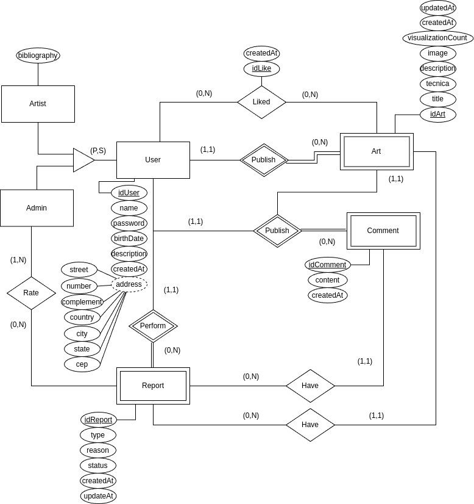

# DER - Diagrama Entidade Relacionamento

## Introdução

O DER (Diagrama Entidade-Relacionamento) é uma ferramenta gráfica fundamental no processo de modelagem de dados, utilizada para representar visualmente o que foi previamente descrito no MER (Modelo Entidade-Relacionamento). Ele mostra como os elementos de um banco de dados se conectam entre si, oferecendo uma visão clara das entidades envolvidas, seus atributos e os relacionamentos existentes entre elas. Sendo um tipo especializado de fluxograma, o DER é amplamente utilizado no desenvolvimento de sistemas para facilitar a compreensão da estrutura de dados antes da implementação.

## Metodologia

Para o desenvolvimento deste diagrama, foi utilizado a plataforma Draw.io para desenho do diagrama. Ademais, para idealização do mesmo, foram usados como fonte de informações as dicuções realizadas entre a equipe nas reuniões até o momento, bem como outros artefatos produzidos pela equipe, como o protótipo do Figma, o Backlog do Produto e o Diagra de Classes

## Diagrama Entidade-Relacionamento

<b>Figura 1:</b> Diagrama Entidade Relacionamento.

<b>Autores:</b> Marllon Fausto, 2025.

## Referências

> BM. O que é um diagrama de entidade e relacionamento (ERD)? Disponível em: https://www.ibm.com/br-pt/think/topics/entity-relationship-diagram. Acesso em: 9 maio 2025.

> ALURA. MER e DER: entenda suas funções e diferenças. Disponível em: https://www.alura.com.br/artigos/mer-e-der-funcoes. Acesso em: 9 maio 2025.

## Histórico de Versões

| Versão | Data       | Descrição                                                                                     | Autor(es)                                                                                                                                              | Revisores
| ------ | ---------- | --------------------------------------------------------------------------------------------- | ------------------------------------------------------------------------------------------------------------------------------------------------------ | - |
| 1.0    | 09/05/2025 | Adição do Diagrama.               | [Marllon](https://github.com/m4rllon) |[Felipe de Sousa](https://github.com/fsousac)
